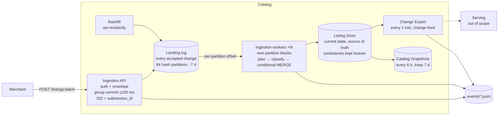

# Commerce Ingestion Pipeline — Design Doc

Sep 30, 2026 · David

Terms are defined in [CONTEXT.md](../CONTEXT.md). Key decisions: [ADR-0001](adr/0001-partition-by-listing-key.md) (partition by Listing key) and [ADR-0002](adr/0002-local-first-delta-no-queue.md) (local-first on Delta, no separate queue). The build order and risk review are in [plan-v1.md](plan-v1.md).

## Overview and goals

Merchants push Listing changes through one Ingestion API. Ingestion workers validate and classify each change, then apply it to the Listing Store, which is the source of truth for current state. Change Export sends recent changes toward serving every minute, and Catalog Snapshots copy the Listing Store a few times a day.

- **Single entry point.** Every change enters through the Ingestion API, so auth and envelope validation live in one place.
- **Correct under chaos.** Out-of-order, duplicate, late and replayed-after-crash changes always converge to the same Listing Store state, and three oracles prove it.
- **Categorized catalog.** Every Listing gets exactly one Primary Category. Uncategorized is the fallback, and categorization never blocks ingestion.
- **Fresh export.** A change is exported within 5 minutes at p99.
- **Stress-testable for free.** Runs entirely on one Mac, with a load generator, full event logging and replay-correctness checks.

## Non-goals

- **Serving, search, ranking, recommendations.** This doc ends at the Change Export output.
- **Product matching** (grouping Listings from different Merchants into one Product). This is future work.
- **Multi-market Merchants.** One Merchant is one storefront, one market, one currency.
- **Per-Category validation rules.** v1 validates the same way for every Category. Rules per Category arrive with Category-specific workers.
- **Long-term history.** The Landing log and snapshots each cover 7 days, and nothing older is kept.
- **Listing expiry.** A Listing lives until it's explicitly deleted, even if a full-catalog feed stops sending it.
- **Per-merchant rate limits, a merchant read API, TLS.** The API binds to `127.0.0.1`.
- **Merchant UI.** Merchants call the Ingestion API directly.
- **Large-company scale.** The target is about 1M Listings, about 50 changes/s at peak, and batches of up to 10k.

## Architecture



Only the Ingestion API and the backfill job write to the Landing log, both append-only. Only a partition's owning worker writes that partition of the Listing Store, and everything else reads.

## Components

| Component | Responsibility | Reads | Writes |
| --- | --- | --- | --- |
| Ingestion API | Authenticates the Merchant, checks the envelope, group-commits accepted changes to the Landing log, returns 202 + `submission_id`. Serves `GET /submissions/{id}`. Rejects bodies over 32 MB (413) and returns 503 when free disk is under 5 GB. | Merchant requests, merchant registry, events | Landing log, events |
| Merchant registry | SQLite: `merchant_id`, `currency`, `key_hash`, `status`. An admin CLI creates Merchants and rotates keys. | — | — |
| Landing log | Append-only Delta table (change feed enabled), partitioned by `partition`. It doubles as the work queue. Retained 7 days. | — | — |
| Ingestion worker | Owns partitions where `partition * N // 64 == index`, holding an `flock` per partition. Loop: read up to 1,000 changes or 200 ms past each partition's offset → plan → classify the batch → one conditional MERGE → events → offsets → heartbeat. Compacts its own partitions every K batches. | Landing log, Listing Store | Listing Store, offsets, events |
| Listing Store | Delta table (change feed enabled), partitioned by `partition`. Current state of every Listing, including Tombstones. | — | — |
| Change Export | Every minute: reads the change feed since its watermark and writes one Parquet file (latest row per changed Listing key; tombstone → `op=delete`), named by version range, then advances the watermark. If the watermark is older than what cleanup kept, it exports a full snapshot instead. Files kept 3 days. | Listing Store | Export files, watermark, events |
| Catalog Snapshots | Every 6 h: copies the Listing Store at a pinned version. Keeps 7 days. Never read to serve shoppers. | Listing Store | Snapshot folders |
| Backfill | Appends `op=reclassify` changes for `needs_reclassify` rows and after taxonomy version bumps. | Listing Store | Landing log |
| Supervisor | Starts processes from a `Procfile`. Restarts any worker whose heartbeat is more than 60 s old. | Heartbeat files | — |

### Change lifecycle

1. The Merchant sends `POST /listings:batch` with 1–10k changes.
2. The Ingestion API authenticates the Merchant and checks each change's envelope (see Data model). Invalid changes are rejected in the response with their index and reasons. The valid ones go through the group commit to the Landing log, each with `partition`, `submission_id` (UUIDv7) and its index. The API returns 202 once the commit succeeds.
3. The partition's owning worker reads the change past that partition's saved offset.
4. **Plan (pure):** compare against the stored row:
   - `source_version` < stored: **stale**
   - `==` stored with the same content hash: **already applied**, which counts as success
   - `==` stored with a different content hash: **conflict**, rejected, and the first write wins
   - `>` stored, or no stored row: **apply**

   A batch behaves exactly like applying its changes one at a time in landing order. Each change is compared with the state left by the changes before it, so batching only decides when writes are flushed, never what they are. A property test checks that outcomes are the same for any batching. A delete of an unknown Listing still writes a Tombstone, so an older upsert that arrives later can't bring it back.

   `op=reclassify` ignores `source_version`: it re-classifies whatever the Listing holds now (`reclassified`), or does nothing if the Listing is missing or deleted (`skipped`). Tying it to a version would let a price-only update make it skip, leaving the Listing on the old taxonomy.
5. **Classify** the Listings the batch leaves live that are new, re-created after a delete, have a changed title, description or attributes, are flagged `needs_reclassify`, were classified under an older taxonomy version, or got `op=reclassify`. A price or stock change never reclassifies. The timeout (200 ms) covers the whole batch. On a timeout or error, those Listings get Primary Category = Uncategorized and `needs_reclassify = true`.
6. **MERGE** the batch in one commit: update only if `s.source_version > t.source_version`, or, for a reclassify-only row, `s.source_version = t.source_version` with an unchanged content hash. An upsert replaces the whole Listing. A delete writes a Tombstone (merchant content cleared, key and `source_version` kept).
7. Emit one event per change (`written`, `stale`, `already_applied`, `conflict`, `failed`, or the internal `reclassified` / `skipped`), then write each partition's offset atomically, then the heartbeat.
8. **Errors:**
   - An exception in one change's logic: retry, then mark `failed` and skip it. If a MERGE fails on the data itself, bisect the batch to isolate the bad change.
   - Storage errors (Landing log read, MERGE commit, offset write): back off. The offset is never advanced, and the worker crashes after N attempts so the supervisor restarts it.
9. On its next tick, Change Export exports the changes, then records the new watermark.

Delivery is at least once throughout. Reprocessing is safe because of step 4's rules and because export consumers upsert by Listing key.

## Data model

A Listing is one sellable variant (the medium red t-shirt), identified by its **Listing key** = `merchant_id` + `merchant_product_id`.

| Field | Type | Set by | Rule |
| --- | --- | --- | --- |
| merchant_id | string | Ingestion API (from API key) | Generated by the server, `m_[a-z0-9]+`. Never read from the payload |
| merchant_product_id | string | Merchant | 1–128 printable characters, case-sensitive, no leading or trailing whitespace. Trusted as-is: no dedupe, a recycled ID is an update, and re-keying is a delete plus a create |
| source_version | int64 | Merchant | Required, > 0, and ≤ now_ms + 24 h. Monotonic per Listing; a millisecond epoch `updated_at` is fine |
| op | enum | Merchant | `upsert` or `delete` (`reclassify` is internal only) |
| title | string | Merchant | Required for upserts, 1–150 characters |
| description | string | Merchant | Optional, ≤ 5,000 characters |
| price_micros | int64 | Merchant | Required for upserts, > 0 |
| currency | string | Merchant | Required for upserts. Must equal the Merchant's currency |
| availability | enum | Merchant | Required for upserts: `in_stock`, `out_of_stock` or `preorder` |
| attributes | map<string,string> | Merchant | ≤ 100 keys; names 1–100 characters, values ≤ 1,000. Includes `gtin`, `brand` and `mpn` (for future Product matching) and `group_id` (Variant group) |
| content_hash | string | Ingestion worker | SHA-256 of the canonical JSON (sorted keys) of the merchant content; a Tombstone hashes `null`. Drives step 4's rules |

All merchant fields are validated in strict mode: `"5"`, `5.0` and `true` are not integers, and unknown fields are rejected, both at the top level and inside `listing`. The request shape is `{"changes": [{"op", "merchant_product_id", "source_version", "listing": {…}}]}`. A delete carries no `listing`.
| primary_category | string | Ingestion worker | Taxonomy node, or Uncategorized |
| taxonomy_version, classify_confidence, needs_reclassify | string, float, bool | Ingestion worker | |
| is_tombstone | bool | Ingestion worker | Kept forever |
| partition | int (0–63) | Ingestion API | `int.from_bytes(sha256(f"{merchant_id}/{merchant_product_id}")[:8], "big") % 64`, which DuckDB and Spark SQL can reproduce |
| submission_id, change_index, received_at | UUIDv7, int, timestamp (UTC) | Ingestion API | Landing log and events. Not used for ordering |

**Submission status** is derived from events, read by an in-memory DuckDB query that only covers event hours from the UUIDv7 timestamp onward. A Merchant can only read its own Submissions. Each change's status is the **best** outcome any event reported for it, in the order written, reclassified, already_applied, conflict, stale, skipped, failed, rejected. It isn't the latest, because a crash replay can only make a merchant change look worse (a written change replays as `already_applied` or `stale`). A change with only `accepted` is `pending`.

## Categorization

- **Taxonomy:** Shopify's open-source product taxonomy, cut to 3 levels. Deeper nodes map to their ancestor.
- **Interface:** `classify(batch) → [(category, confidence)]`. Below the confidence threshold the result is Uncategorized. The threshold is chosen from the eval.
- **v1 classifier:** embedding similarity (fastembed) against Category paths, with the batch embedded in one call.
- **Reclassification:** only in the cases listed in lifecycle step 5, and only through the Landing log.

## State on disk

```
data/landing_log/  data/listing_store/  data/snapshots/<ts>/  data/export/<v1>-<v2>.parquet
data/events/<yyyy-mm-ddThh>/<process>.jsonl   data/merchants.sqlite
state/offsets/pNN.json  state/export_watermark.json  state/locks/pNN.lock  state/heartbeat/<worker>.json
```

Offsets and watermarks are written atomically (write to a temp file, then `os.replace`). Retention: Landing log 7 days, events and export files 3 days, snapshots 7 days. All are configurable.

## Observability and testing

- **Events:** one JSONL line per stage per change, carrying `submission_id`, `change_index`, the Listing key, `partition`, the Listing Store version where relevant, and a timestamp. Each process writes its own files.
- **DuckDB is a read-only query engine.** Each query uses a throwaway in-memory connection over Delta (via `to_pyarrow_dataset()`), JSONL and Parquet. The pipeline never writes to DuckDB.
- **Metrics (saved SQL):** freshness p50/p99, worker lag per partition, classify latency, rates of stale, conflict, failed and Uncategorized changes, worker utilization.
- **Three oracles:**
  1. **Store:** the Landing log (excluding rejected, conflicting and failed changes) → highest `source_version` per key → full replace → tombstones must equal the Listing Store, compared on merchant fields, `source_version` and the tombstone flag. It runs from an empty store.
  2. **Export:** replaying the export files in order must equal the Listing Store at the watermark.
  3. **Snapshot:** each snapshot must equal the Listing Store at its pinned version.
- **Tests:** a functional core with an imperative shell. Pure modules have 100% branch coverage, and the whole package at least 90%. A Hypothesis property test checks plan against the store oracle. Integration tests run on real Delta tables. Details are in the plan.
- **CI:** GitHub Actions on every PR, and checks are required before merging to `main`.

## Runtime

Local-first on one Mac (ADR-0002), Python 3.14:
- Delta tables through `deltalake` (delta-rs)
- FastAPI and uvicorn, in a single process
- worker processes, started by `honcho` from a `Procfile`
- fastembed; Laya on MLX for the experiment

No Docker, because MLX can't use the GPU inside it. Stress runs go under `caffeinate`. A later move to Databricks keeps the same tables.

## Future work

- **Classifier experiment.** On a 200-Listing eval set, compare (a) Laya hierarchical choice, (b) an embedding shortlist of 10 followed by a Laya choice, (c) embeddings only, and (d) an embedding shortlist of 10 followed by a TypeSafe Jev `Choice` call, on accuracy, latency and cost. Jev is a paid API at $0.042 per million input tokens (output free), about $17 to classify 1M Listings once. Its 40 requests/s limit sits below the 50 changes/s peak, so overflow takes the timeout → Uncategorized path. If Laya wins, it runs as one shared classifier process, because 16 GB of RAM can't hold one model per worker.
- **Category memberships.** Zero or more extra Categories per Listing for browsing and recommendations. They never drive processing.
- **Category-specific workers and rules.** Dedicated pools and validation for Categories that need their own code or much more capacity. These sit on top of Listing-key partitioning (ADR-0001), not in place of it.
- **Product matching.** Group Listings from different Merchants into one canonical Product. This is a separate step after Categorization: use the Primary Category plus GTIN, brand and MPN to narrow candidates, then match. It's the most important next step and the hardest.
- **Multi-market Merchants**, **Listing expiry**, **per-merchant rate limits**, **merchant read API**, **webhooks**, **long-term history**.
- **Serving scale.** Heavy serving read load may need fan-out or a dedicated serving store.
